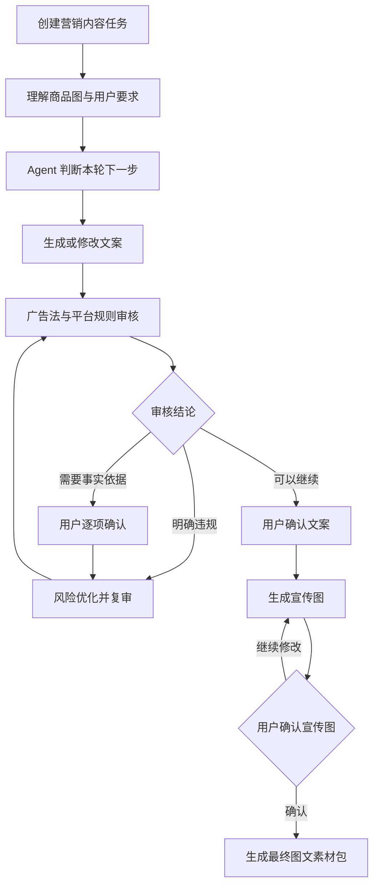

# EcomAgent｜电商内容运营 Agent

面向电商商家和品牌运营人员的内容运营工作台。

用户只需要提交一次商品宣传目标和商品实物图，系统会围绕同一个营销内容任务持续推进：理解要求、生成平台文案、依据广告法与平台规则审核、处理需要确认的宣传事实、生成宣传图，最后交付与当前确认版本一致的图文素材包。

资源资料的来源、用途与授权边界见 [resources/README.md](resources/README.md)。

## 1. 项目解决的问题

营销内容创作不是一次性的“输入一句话，返回一段文字”。实际工作中，用户通常还需要处理这些问题：

- 商品卖点如何完整保留并组织成适合目标平台的表达；
- 文案中的事实、价格、功效和比较表达是否需要依据；
- 明确违规内容应该直接改写，还是需要用户确认事实；
- 用户在多轮修改、解释、比较和恢复版本后，系统如何保持任务状态；
- 文案确认后，如何继续完成宣传图和最终图文素材包，而不是重新开始一个孤立任务。

本项目把这些过程统一为一个可持续推进的营销内容任务。大模型负责理解和决策，领域代码负责保存版本、确认、审核结论和交付约束，二者共同形成可追踪的工作闭环。

## 2. 核心功能

### 营销内容任务

- 输入平台、商品和宣传目标；
- 上传一张商品实物图；
- 保存任务历史并支持再次进入；
- 在同一个任务中继续对话，不丢失已确认的要求和版本。

### 文案协作

- 根据商品信息和目标平台生成初稿；
- 通过自然语言提出修改、解释、比较和恢复要求；
- 保留多个文案版本，并展示当前版本与上一版本的差异；
- 尽量保留用户提供的商品事实，不让改写过程擅自新增未经提供的事实。

### 合规审核与人工确认

- 检索广告法和平台规则作为审核依据；
- 对当前候选文案形成结构化审核结论；
- 明确违规表达直接进入风险优化；
- 需要用户确认依据的宣传事实逐项展示；
- 用户可以分别选择保留事实或接受风险改写；
- 同时保存优化前和优化后的审核等级、评分及处理结果。

### 宣传图与发布包

- 使用用户上传的商品实物图作为宣传图生成输入；
- 从已确认的商品要求和文案中提炼画面宣传点；
- 由图像模型自主完成场景、构图、光影和视觉风格设计；
- 宣传图单独等待用户确认，文案变化会使旧图失效；
- 最终交付当前确认文案、审核结果和已确认宣传图组成的发布包。

## 3. 使用流程



用户每轮输入都回到同一个任务上下文中。留空提交不是“继续调用默认流程”，而是由当前任务阶段决定含义：文案已确认时进入宣传图，宣传图已确认时生成最终发布包。

## 4. Agent 如何工作

本项目使用的是一个面向营销内容任务的单 Agent，而不是开放式聊天机器人。它的自主性体现在：

1. 识别用户本轮是在创建、修改、解释、比较、恢复、确认文案，还是调整宣传图；
2. 结合任务当前阶段、已有版本、审核结论和待确认事项选择下一步语义动作；
3. 只把当前动作所需的信息交给对应工具，避免让每个模型调用都携带完整无关历史；
4. 根据工具结果继续推进，或在需要用户判断时暂停并保存任务状态；
5. 在模型输出不符合契约时，将结构化错误回传给当前任务，而不是悄悄生成不可追踪的结果。

它不会绕过人工确认，也不会代替用户证明商品事实、授权、检测报告或平台资质的真实性。

## 5. LangGraph 任务生命周期

LangGraph 负责管理一个营销内容任务的生命周期、暂停、恢复和 checkpoint。图中的节点按职责分为四组：

- **任务理解**：准备本轮输入、分析商品图、理解用户意图；
- **内容处理**：生成文案、审核候选、应用审核结果、风险优化；
- **视觉处理**：规划宣传图、调用图像模型、等待用户确认；
- **交付**：构建最终图文素材包。

Agent Controller 不直接修改任务数据，只输出经过契约解析的语义决策。领域模型负责版本、要求、审核结论、人工确认和图文素材包的一致性。工具负责具体的模型调用和知识检索。

```text
用户输入
   |
   v
LangGraph checkpoint
   |
   +--> Agent Controller：理解本轮意图并选择语义动作
   |
   +--> 文案生成 / 合规审核 / 风险优化 / 商品图分析 / 宣传图生成
   |
   +--> 领域状态：要求、版本、审核、确认、任务阶段
   |
   +--> 暂停等待用户，或进入下一阶段
```

## 6. 项目结构

```text
backend/app/
├── api/              FastAPI 接口
├── application/      Agent 决策契约和发布包构建
├── domain/           发布任务、要求、版本和确认状态
├── infrastructure/   模型执行、配置、SQLite 和 checkpoint
├── knowledge/        广告法与平台规则检索
├── orchestration/    LangGraph 任务生命周期
├── schemas/          API 请求和响应模型
├── services/         发布任务服务门面
└── tools/             商品图、文案、审核和宣传图工具

frontend/src/
├── task-workspace/   按任务阶段展示操作区
├── api.ts            后端接口访问
├── types.ts          前端领域类型
└── App.tsx           React 工作台入口

resources/            广告法和平台规则资料
tests/                后端领域、契约、恢复和生命周期测试
docs/                 API 文档
```

## 7. 技术栈

- **后端**：Python、FastAPI、Pydantic
- **Agent 编排**：LangGraph、LangGraph SQLite Checkpointer
- **模型接入**：DashScope OpenAI-compatible API
- **文本模型职责**：任务理解与决策、文案生成与修改、合规审核
- **图像模型职责**：基于商品实物图生成宣传图
- **知识检索**：本地广告法和平台规则资料
- **持久化**：SQLite，保存任务 checkpoint、版本和图片资产元数据
- **前端**：React、TypeScript、Vite、TanStack Query、Lucide React
- **验证**：Pytest、Vitest、TypeScript 类型检查和 Vite 生产构建
